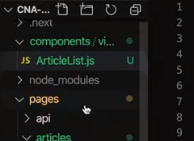

NEXT.js
===

## NEXT.js의 유용한 기능
#### - 양재동 코드랩 NEXT.JS (1주차) - [YouTube ☞](https://www.youtube.com/watch?v=t6j48rn15lQ)
<br>

``` html
<Link href="pages/home">
	<a>home</a>
</Link>
```
1.&nbsp;Link : 페이지가 이동될 때 초기 로드한 리소스를 다시 로드하는 것을 방지한다.<br>
페이지 이동을 해도 새로고침이 일어나지 않는 SPA처럼 동작할 수 있게 된다.
새 페이지 로드 시 필요한 파일만 우선적으로 불러온다. (lazy load)
<br>
<br>

<br>
2.&nbsp;component : 공통으로 쓰이는 템플릿은 component 디렉토리에 분리하여 따로 관리하고,<br>
필요 시에만 import로 불러와 사용한다.
<br>
<br>

``` javascript
import Head from 'next/head';

function ReadMe(props) {
    return (
        <div>
            <Head>
                <title>Article List</title>
            </Head>

            <h1>Read Me</h1>
        </div>
    )
}

export default ReadMe;
```
3.&nbsp;next/head : 각각의 페이지에서 <Head></Head>태그 안에 해당 페이지명을 넣어주기만 하면 페이지의 타이틀이 재정의 되며, 단순히 동적으로만 동작하지 않고 서버사이트 랜더링에도 반영이 된다. 따로 타이틀을 정의하지 않은 페이지는 기존의 타이틀이 노출된다.